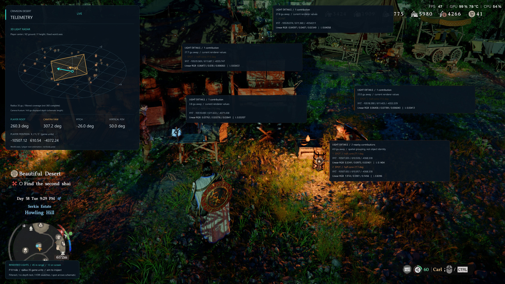

# Crimson Desert Telemetry

**Live light, player and camera data for Crimson Desert — with local HTTP and WebSocket APIs, fullscreen light markers and a 3D light radar.**

Version **2.0.0** brings lighting to the foreground: inspect the positions, colors and brightness of current light contributions from fires, candles, lanterns and glass/crystal lamps, alongside the player and render camera. Use the data in your own overlays, tools and lighting integrations.

[Releases](https://github.com/fabianviol/CrimsonDesertTelemetry/releases)
· [Watch the demo](https://youtu.be/eyRkkTXAU64)
· [API reference](docs/API.md)
· [Client examples](examples)

[](https://youtu.be/eyRkkTXAU64)

*In-game light markers, separate contributions around a fire, and the player-centered 3D radar. Click the screenshot to watch the video.*

## What you get

| Data / view | Included |
|---|---|
| **Lights** | World position, current linear HDR RGB, derived linear luminance, and direction/cone half-angle for recognized spot contributions |
| **Player** | World position, physics-root forward/up vectors and heading when valid |
| **Camera** | Native render-camera position, orientation, vertical FOV, aspect ratio and near plane |
| **Fullscreen light overlay** | Markers at projected light positions; aim toward a source to inspect position, color, brightness and distance |
| **3D light radar** | Nearby light contributions with height, player heading and a camera frustum that follows pitch and roll |
| **Local API** | HTTP snapshots and health, WebSocket streaming, JSON Schema and JSON Lines recordings |
| **Status notices** | Brief success when data becomes ready; actionable startup/build/capture errors |

Lighting, both HUD views and status notices are enabled in the supplied configuration. Each can be configured separately; the HUD is not required to consume the API.

**No NVIDIA or DLSS requirement.** The camera is read directly from the engine, not from a DLSS/Streamline data stream. Light capture and the overlay use standard DirectX 12 interfaces. Neither Nsight nor PIX is needed to run the mod. AMD/Intel game compatibility has not yet been tested.

**SDR and HDR overlays.** The DirectX 12 renderer supports 8-bit and 10-bit SDR, HDR10 (10-bit PQ/Rec.2020), and FP16 scRGB. It automatically uses the game's buffer format and color space for the HUD, light markers and notices. All 14 native tests pass, including three new HDR tests, real ImGui rendering and SDR/scRGB transitions; no live HDR-display/game test has been performed. [Validation details](docs/OVERLAY_VALIDATION.md).

## Install or upgrade

Requirements:

- Windows x64 and a supported Crimson Desert build.
- Microsoft **.NET 8 ASP.NET Core Runtime (x64)**.
- An x64 ASI loader, such as Ultimate ASI Loader, installed for the game.

1. Close Crimson Desert.
2. Download the **ModManagers.zip** asset from the release — not GitHub's source-code archive.
3. Disable the previous telemetry package and any separate **CrimsonHueConsole** package in your mod manager.
4. Import **and activate/deploy** the new package in Definitive Mod Manager (DMM) or JSON Mod Manager. Keep all included files together.
5. Start the game and load a save. The local host starts automatically.

DMM deployment and a packaged cold start were verified locally before the HDR addition. A complete install/uninstall test matrix for both managers and other systems is still open; see the [validation record](docs/MOD_MANAGER_VALIDATION.md).

Do not merge old binaries or metadata into the new package. Preserve your INI preferences, but migrate them into the current sections. Replace both `.cfg` companions together with the DLLs; they contain .NET metadata and must **not** be renamed to `.json`, which DMM can interpret as game patches. Do not leave the former console ASI in a loader search path.

### Controls and configuration

| Key | Action |
|---|---|
| **F8** | Show/hide the corner HUD and 3D radar |
| **F9** | Toggle additional diagnostics |
| **F10** | Show/hide fullscreen light markers |

The HUD does not capture mouse input. Hiding it does not stop telemetry.

Edit `CrimsonDesertTelemetry.ini` before starting the game:

```ini
[Server]
Enabled=1
Port=27311
SampleRateHz=60

[Lights]
Enabled=1
NearbyRadius=100
ManyLights=1
ManyLightsSampleRateHz=20

[Overlay]
Enabled=1
Radar3D=1
HdrPaperWhiteNits=200

[LightOverlay]
Enabled=1
Radius=35
MaxMarkers=512
MaxLabels=6

[Notifications]
Enabled=1
DurationMilliseconds=6000
```

- `[Lights] Enabled=0` disables both authored and rendered light feeds. `ManyLights=0` disables only the native GPU light capture.
- `NearbyRadius` controls the API's player-centered light radius; `LightOverlay.Radius` controls both light views. Distances are **game units**, not a claimed metre conversion.
- Disable **Overlay, LightOverlay and Notifications** to skip all UI hooks/client. The server and light capture have their own switches.
- `InitiallyVisible=0` hides an enabled view at launch; hotkeys cannot enable a view whose `Enabled=0`.
- `HdrPaperWhiteNits` controls all HDR UI brightness, including markers and notices with the corner HUD disabled. The default is 200 nits, clamped to 80–500. It does not change the game's HDR settings or metadata.
- Radar/marker swatches visualize measured HDR values; they do not reproduce the game's tone mapping. Nearby contributions share a detail box without merging, summing or smoothing their raw measurements.
- The camera frustum uses the real basis and view angles; its drawn length is schematic. World X/Z axes are not compass north; player-root orientation is not an animated body pose.

### Startup and errors

There is no persistent "loading" notification. A success notice appears for six seconds once requested data is available, **which can already happen during the visible loading sequence**. The duration is configurable from 5–10 seconds. Actionable errors may appear immediately and remain until resolved.

The status display starts independently of game-memory validation, so an unknown EXE or missing host/runtime can still produce an explanation. If the graphics overlay itself cannot run, consult the logs beside the plugin:

- `CrimsonDesertTelemetry.bootstrap.log`
- `CrimsonDesertTelemetry.host.log`
- `CrimsonDesertTelemetry.native.log`
- `CrimsonDesertTelemetry.overlay.log`

Known behavior: after returning to the title screen without restarting, data/HUD may persist briefly before becoming stale or being replaced during loading. The views remain hideable with F8/F10. Telemetry availability is not a definitive menu/loading-screen detector.

## Use the data

Connect through **HTTP** at `http://127.0.0.1:27311` or **WebSocket** at `ws://127.0.0.1:27311/v1/stream`. Both carry JSON; JSON is the data format, not a separate connection method. The server binds to **IPv4 loopback only**.

| Endpoint | Purpose |
|---|---|
| `GET /v1/snapshot` | Latest telemetry snapshot |
| `GET /v1/health` | Game, compatibility and capture health |
| `GET /v1/schema` | JSON Schema for the active payload |
| `WS /v1/stream` | Live JSON messages |

```powershell
Invoke-RestMethod http://127.0.0.1:27311/v1/snapshot
```

Version **2.0.0** is the product version; routes remain **HTTP API v1**. With lights enabled the additive snapshot schema is **1.4**. With lights disabled it remains **1.1**. Clients should check capability/status fields and freshness instead of assuming every source is always available.

- `lights.sources` contains authored engine-light records.
- `lights.rendered.sources` contains current filtered renderer contributions, including the investigated fire/candle path, reconstructed using the camera paired with their capture.
- Player/camera telemetry defaults to 60 Hz; native light capture defaults to 20 Hz. Faster API polling does not create additional GPU samples.
- The arrays **overlap**; do not add them together. One physical lamp can produce several contributions.

See [API fields, examples and freshness rules](docs/API.md) and the [client examples](examples). This is a local data API, not an API for controlling the game. CrimsonHue is a separate, future Philips Hue integration built on this telemetry.

### Running from source

For development, install the .NET 8 SDK:

```powershell
dotnet run --project .\src\CrimsonDesertTelemetry.Cli -- diagnose
dotnet run --project .\src\CrimsonDesertTelemetry.Cli -- serve 27311 60 --lights
dotnet run --project .\src\CrimsonDesertTelemetry.Cli -- track 0 60 --lights > telemetry.jsonl
```

The external host alone can read player/camera and supported authored lights. **Filtered rendered lights require the unified ASI in the game.** Do not start a second host on the same port as the ASI-owned one. Status messages go to stderr; JSON Lines go to stdout.

## Compatibility and limits

The complete 2.0 lighting path targets **Steam build 25116796 / EXE 1.0.0.2760**, using its exact validated SHA-256. Player/camera profiles for builds 24994088 and 25050808 remain preserved; those historical checks do not establish current full-light support on old builds.

Native capture validates the EXE, hook instructions and surrounding caller/binding contexts before instrumentation. Shared build contracts and the read-only command below help recover after updates:

```powershell
dotnet run --project .\src\CrimsonDesertTelemetry.Cli -- check-update 'C:\path\to\CrimsonDesert.exe'
```

The report **does not enable an unknown build**. Historical basic-telemetry layouts have guarded automatic relocation, but the current direct-camera/ManyLights path is not automatically promoted. Future engine or shader-only asset changes can still require an update. See the [update recovery reference](docs/UPDATE_RECOVERY.md).

Important boundaries:

- This is current **filtered renderer data**, not a complete registry of every visible light. Sun, sky, emissive surfaces and every possible effect are not all covered.
- A missing contribution is **not** a permanent physical OFF state. Stable lamp IDs, physical lumens and validated light ranges are not supplied.
- Linear HDR RGB/luminance can vary with effects and exposure; they are not final screen pixels or exposure-normalized lamp colors.
- The radar can show behind-camera contributions still present in the feed, but is **not** a complete 360-degree registry.
- Fullscreen markers have **no scene-depth test** and can appear through walls. Fast motion can expose the latency between a light capture and the latest projection camera.
- HDR UI is composited in linear light, with configurable white brightness and unchanged pixels outside the UI. It does not tone-map the whole scene. Rendering HDR UI uses two extra full-resolution GPU textures plus a scene copy/composite; the SDR path has no extra compositor pass.
- Unrecognized output format/color-space combinations remain unsupported. Automated HDR rendering tests do not establish live HDR game or display compatibility; frame generation, other upscalers and AMD/Intel game setups remain unvalidated.
- The external host reads process memory. The unified ASI uses guarded renderer hooks, GPU copies and optional UI hooks; the full system is **not purely read-only instrumentation**. The bundled research console can change debug values when explicitly enabled and is off by default.

## Build, test and contribute

```powershell
dotnet build .\CrimsonDesertTelemetry.sln -c Release
dotnet run --project .\tests\CrimsonDesertTelemetry.Tests -c Release
.\scripts\Build-ModManagerPackage.ps1 -Version 2.0.0
ctest --test-dir build/native-package -C Release --output-on-failure
```

The native build requires Visual Studio C++/Windows SDK/CMake. Package builds refuse to overwrite an existing versioned ZIP. GitHub CI covers managed/API tests and native capture, guard and UI tests.

See [contributing](CONTRIBUTING.md), [research provenance](docs/PROVENANCE.md), [2.0 release notes](docs/releases/v2.0.0.md) and [Nexus publishing](docs/NEXUS_PUBLISHING.md). Game binaries, memory dumps, private captures and third-party checkout directories do not belong in the public repository.

## Credits and scope

Created and maintained by [fabianviol](https://github.com/fabianviol), developed with **Claude** and **Codex (OpenAI)**. Runtime third-party components are credited in [provenance](docs/PROVENANCE.md) and the package's `THIRD-PARTY-NOTICES.txt`.

This unofficial community project is not affiliated with or endorsed by Pearl Abyss. Use it only where game terms and applicable restrictions permit; no anti-cheat bypass or competitive advantage is provided. Source is licensed under the [MIT License](LICENSE).
